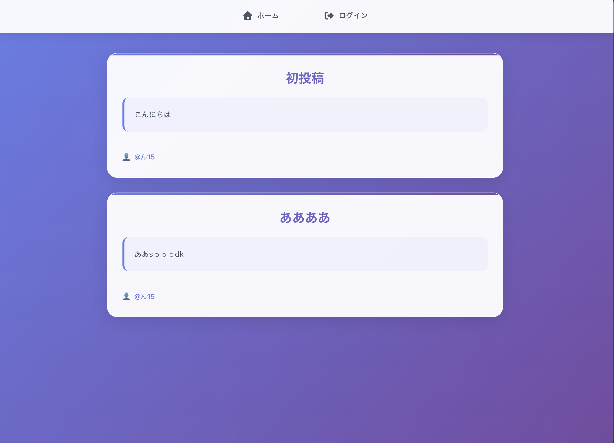

# 📝 ブログアプリ with React & Firebase

美しいデザインと使いやすさを重視したブログアプリケーションです。ReactとFirebaseを使用して構築されており、Googleアカウントでログインして記事の投稿・管理ができます。

## ✨ 主な機能

- 🔐 **Google認証**: 簡単なGoogleログイン
- ✍️ **記事投稿**: タイトルと内容を投稿
- 📱 **レスポンシブデザイン**: あらゆるデバイスに対応
- 🎨 **モダンUI**: 美しいガラスモーフィズムデザイン
- 🗑️ **記事削除**: 自分の投稿を削除
- 📖 **記事閲覧**: 全ユーザーの投稿を閲覧

## 🚀 デモ

**🌐 ライブデモ**: [https://blog-8598a.web.app](https://blog-8598a.web.app)



## 🛠️ 技術スタック

- **フロントエンド**: React 19.1.1
- **スタイリング**: CSS3 (ガラスモーフィズム、グラデーション)
- **バックエンド**: Firebase Firestore
- **認証**: Firebase Authentication (Google)
- **ルーティング**: React Router DOM
- **アイコン**: Font Awesome

## 📦 インストール

### 前提条件

- Node.js (v16以上)
- npm または yarn
- Googleアカウント

### セットアップ手順

1. **リポジトリをクローン**
   ```bash
   git clone https://github.com/yourusername/blog-with-react-and-firebase.git
   cd blog-with-react-and-firebase
   ```

2. **依存関係をインストール**
   ```bash
   npm install
   ```

3. **Firebase設定**
   - [Firebase Console](https://console.firebase.google.com/)でプロジェクトを作成
   - Firestore Databaseを有効化
   - AuthenticationでGoogle認証を有効化
   - プロジェクト設定から設定情報を取得

4. **環境変数の設定**
   - プロジェクトルートに`.env.local`ファイルを作成
   - 以下の内容を追加（実際のFirebase設定値に置き換え）：
   ```bash
   REACT_APP_FIREBASE_API_KEY=your-api-key-here
   REACT_APP_FIREBASE_AUTH_DOMAIN=your-project.firebaseapp.com
   REACT_APP_FIREBASE_PROJECT_ID=your-project-id
   REACT_APP_FIREBASE_STORAGE_BUCKET=your-project.appspot.com
   REACT_APP_FIREBASE_MESSAGING_SENDER_ID=your-sender-id
   REACT_APP_FIREBASE_APP_ID=your-app-id
   ```

5. **アプリケーションを起動**
   ```bash
   npm start
   ```

6. **ブラウザで確認**
   [http://localhost:3000](http://localhost:3000) を開いてアプリケーションを確認

## 🎯 使い方

### ログイン
1. ホームページで「ログイン」をクリック
2. Googleアカウントでログイン
3. 認証が完了すると自動的にホームページに戻ります

### 記事投稿
1. ログイン後、「記事投稿」をクリック
2. タイトルと投稿内容を入力
3. 「投稿する」ボタンをクリック
4. 投稿が完了するとホームページに表示されます

### 記事閲覧
- ホームページで全ユーザーの投稿を閲覧できます
- 投稿者名、タイトル、内容が表示されます

### 記事削除
- 自分の投稿の「削除」ボタンをクリック
- 確認なしで即座に削除されます

## 🎨 デザインの特徴

### モダンなUI/UX
- **ガラスモーフィズム**: 半透明背景とブラー効果
- **グラデーション**: 美しい色のグラデーション
- **アニメーション**: スムーズなホバー効果とトランジション
- **レスポンシブ**: デスクトップ、タブレット、モバイルに対応

### カラーパレット
- **メインカラー**: ブルーグラデーション (#667eea → #764ba2)
- **アクセント**: 赤色 (#dc3545) - 削除ボタン
- **背景**: グラデーション背景
- **テキスト**: ダークグレー (#2d3748, #4a5568)

## 📱 レスポンシブ対応

- **デスクトップ** (1024px以上): 最大幅800pxのカードレイアウト
- **タブレット** (769px - 1024px): 最大幅700pxに調整
- **モバイル** (481px - 768px): パディングとフォントサイズを最適化
- **小型モバイル** (480px以下): 最小限の余白とタッチ操作に最適化

## 🔧 開発者向け情報

### 利用可能なスクリプト

```bash
# 開発サーバーを起動
npm start

# プロダクションビルド
npm run build

# テストを実行
npm test

# 設定をeject（非推奨）
npm run eject
```

### プロジェクト構造

```
src/
├── components/          # Reactコンポーネント
│   ├── Home.jsx        # ホームページ
│   ├── CreatePost.jsx  # 記事投稿
│   ├── Login.jsx       # ログイン
│   ├── Logout.jsx      # ログアウト
│   └── Navbar.jsx      # ナビゲーション
├── firebase.js         # Firebase設定
├── App.jsx             # メインアプリ
└── index.js            # エントリーポイント
```

## 🚀 デプロイ

### Firebase Hosting

1. **Firebase CLIをインストール**
   ```bash
   npm install -g firebase-tools
   ```

2. **Firebaseにログイン**
   ```bash
   firebase login
   ```

3. **プロジェクトを初期化**
   ```bash
   firebase init hosting
   ```

4. **ビルドしてデプロイ**
   ```bash
   npm run build
   firebase deploy
   ```

### その他のプラットフォーム

- **Vercel**: `vercel --prod`
- **Netlify**: `netlify deploy --prod`
- **GitHub Pages**: `npm run deploy`

## 🤝 コントリビューション

1. このリポジトリをフォーク
2. 機能ブランチを作成 (`git checkout -b feature/amazing-feature`)
3. 変更をコミット (`git commit -m 'Add amazing feature'`)
4. ブランチにプッシュ (`git push origin feature/amazing-feature`)
5. プルリクエストを作成

## 📄 ライセンス

このプロジェクトはMITライセンスの下で公開されています。詳細は[LICENSE](LICENSE)ファイルを参照してください。

## 🙏 謝辞

- [React](https://reactjs.org/) - 素晴らしいフロントエンドライブラリ
- [Firebase](https://firebase.google.com/) - バックエンドサービス
- [Font Awesome](https://fontawesome.com/) - 美しいアイコン
- [Create React App](https://create-react-app.dev/) - プロジェクトの基盤

## 📞 サポート

質問や問題がある場合は、[Issues](https://github.com/yourusername/blog-with-react-and-firebase/issues)でお知らせください。

---

⭐ このプロジェクトが気に入ったら、スターを付けてください！
